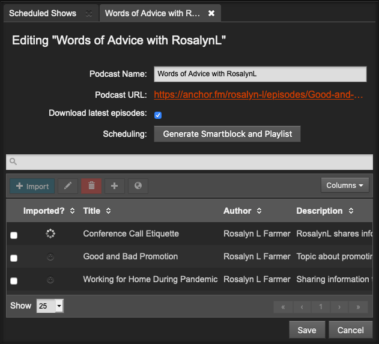

La page Podcasts vous permet d'ajouter des abonnements à des podcasts qui sont souvent utilisés pour syndiquer des fichiers audio en utilisant une URL appelée flux RSS. Cela permet à votre instance LibreTime de télécharger automatiquement les nouvelles émissions depuis le web.

:::info

Tous les podcasts disponibles sur iTunes ont un flux RSS mais celui-ci est parfois caché. Voir le problème n°510 pour plus d'informations. Les flux RSS qui ne se terminent pas par .xml peuvent être acceptés par LibreTime mais ne pas télécharger les épisodes. Une solution consiste à télécharger l'épisode à l'aide d'un client de podcast tel que gpodder, puis à télécharger et programmer manuellement l'épisode.

Les flux de podcast provenant d'Anchor.fm sont connus pour avoir un problème similaire.

:::

Les interfaces de podcast vous permettent de générer des Smartblocks [Smartblocks](./playlists.md) qui peuvent être utilisés en conjonction avec des listes de lecture automatiques pour programmer l'épisode le plus récent d'un podcast sans intervention humaine.

<iframe
    width="560"
    height="315"
    src="https://www.youtube-nocookie.com/embed/g-4UcD8qvR8"
    frameborder="0"
    allow="accelerometer; autoplay; encrypted-media; gyroscope; picture-in-picture"
    allowfullscreen
></iframe>

### Tableau de bord des podcasts

Le tableau de bord des podcasts est similaire à la vue des pistes, vous permettant d'ajouter, de modifier et de supprimer des podcasts par la barre d'outils, en plus du tri par colonnes.

Pour ajouter un podcast, cliquez sur le bouton **+ Ajouter** de la barre d'outils et fournissez le flux RSS du podcast, qui se termine généralement par .xml. Une fois le flux du podcast reconnu, le panneau d'édition s'ouvre pour le podcast.

### Éditeur

Dans l'éditeur de podcasts, vous pouvez renommer le podcast, mettre à jour les paramètres du podcast et gérer les épisodes.
Un champ de recherche est disponible pour rechercher des épisodes dans le flux.

- Pour importer un épisode directement dans LibreTime, double-cliquez sur un épisode ou sélectionnez-le et cliquez sur **+ Importer**. Le podcast apparaîtra sous les pistes avec le nom du podcast comme album.
- Pour supprimer un épisode de LibreTime, sélectionnez l'épisode et cliquez sur la poubelle rouge de la barre d'outils.
- Si vous souhaitez que LibreTime télécharge automatiquement les derniers épisodes d'un podcast, assurez-vous que l'option ùùTélécharger les derniers épisodes\*\* est cochée. Cette option peut être utilisée en conjonction avec les Smartblocks et les Playlists pour automatiser le téléchargement et la programmation d'émissions reçues via le flux de podcasts.
